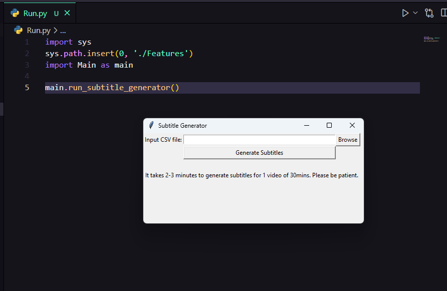
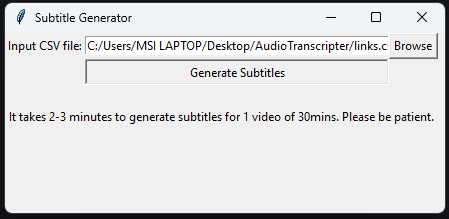
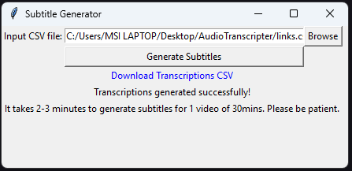
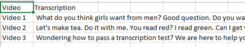

# README: Transcribing Audio Segments with OpenAI's Whisper Model

---

## Steps

`Clone the Repo`

`run the Run.py`

`Input a csv file with youtube links in rows`

`Generate the subtitles`

`Download the csv file after completed`

`Ouput`

---

## Introduction

This README provides an overview and instructions for using the provided Python script to transcribe audio segments using OpenAI's Whisper model. The script downloads audio segments from a YouTube video and transcribes them into text.

---

## Dependencies

Before running the script, ensure you have the following dependencies installed:

- Python 3.x
- PyTube (`pip install pytube`)
- MoviePy (`pip install moviepy`)
- Whisper (`pip install openai-whisper`)

---

## Usage

1. **Clone the Repository:**

   Clone the repository containing the Python script to your local machine.

2. **Run the Script:**

   Open a terminal or command prompt and navigate to the directory containing the Python script.

   Run the script using the following command:

3. **Follow the Instructions:**

- The script will prompt you to enter the URL of the YouTube video you want to transcribe.
- It will download the audio segments from the video and transcribe them using OpenAI's Whisper model.
- The detected language and recognized text for each audio segment will be printed in the terminal.

---

## Understanding the Script

- The script leverages the PyTube library to download audio segments from the specified YouTube video.
- It utilizes the Whisper model provided by OpenAI to transcribe the audio segments.
- Audio segments are processed using log-Mel spectrograms before being transcribed.
- The script outputs the detected language and recognized text for each audio segment.

---

## Notes

- Ensure you have an active internet connection to download the YouTube video and utilize the Whisper model.
- The provided script assumes that the audio segments are saved as "audio1.mp3", "audio2.mp3", and so on in the current directory.
- Make sure you have appropriate permissions to download and process the audio segments.

---

## Credits

- OpenAI for providing the Whisper model.
- PyTube and MoviePy developers for creating useful libraries for working with YouTube videos and audio processing in Python.

---

## Disclaimer

- This script is provided as-is and may require adjustments based on your specific requirements and environment.
- Use the script responsibly and ensure compliance with YouTube's terms of service and copyright policies.

---

Feel free to reach out for further assistance or clarification. Happy transcribing!
